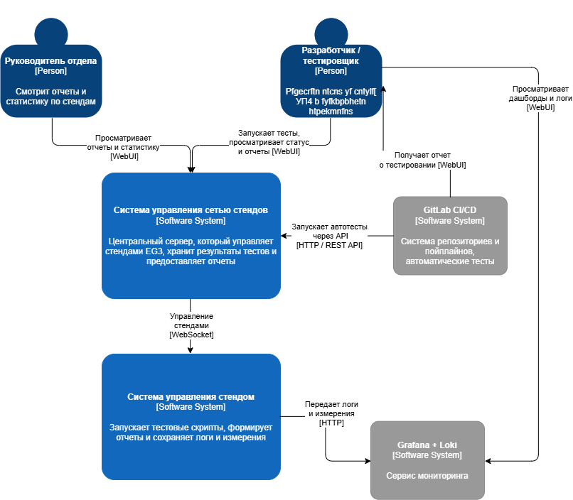

# Лабораторная работа №2
**Тема:** Использование нотации C4 model для проектирования архитектуры программной системы
**Цель работы:** Получить опыт использования графической нотации для фиксации архитектурных решений
## Диаграмма системного контекста
Кратко о системе:
«Система управления сетью стендов EG3» – программно-аппаратный комплекс, который позволяет запускать автоматические тесты, управлять стендами и просматривать результаты тестов по всем стендам компании. Каждый стенд включает тестируемое устройство FORT-112EG3, PSAP-устройство для приёма экстренных вызовов и передачи MSD, блок реле/измерителей и Raspberry Pi, на котором крутятся сервисы стенда.

Основные акторы:
- Разработчик / тестировщик:
    Через веб-интерфейс:
    - запускает тесты на выбранном стенде или группе стендов
    - просматривает логи и метрики
    - выгружает отчёты о тестировани
    Автоматически:
    - запуск тестов из GitLab CI/CD
- Руководитель отдела:
    - Просматривает статистику по всем стендам: процент пройденных тестов, стабильность релизов, количество инцидентов

Внешние системы:
- GitLab - система управления репозиториями
- InfluxDB - база данных для хранения измерений
- Grafana - сервис для создания дашбордов
- Loki - сервис для хранения логов

Диаграмма системного контекста:   

## Диаграмма контейнеров

Состав контейнеров:
 - WEB-приложение  
    Предоставляет единый интерфейс для разработчиков, тестировщиков и руководителя: выбор стенда, запуск тестов, просмотр статуса прогонов и отчётов.
 -  API сервера управления сетью стендов  
    Принимает запросы от WEB-клиента и от GitLab CI/CD, выполняет авторизацию и валидацию, формирует задания на выполнение тестов, опрашивает состояние стендов. Является центральной точкой оркестрации.
 - Брокер сообщений  
    Хранит очередь задач на выполнение тестов. API сервера кладёт в очередь задания, а нижележащие компоненты стендов считывают их и отчитываются о результате.
 - Grafana + Loki   
    Получает от сервера логи и измерения, используется пользователями для просмотра дашбордов и детализированных логов.

Система управления отдельным стендом:
- API управления стендом   
    Принимает задачи из брокера, запускает тестовый сценарий, собирает результаты и возвращает их на центральный сервер.
- API EG3   
    Сервис управления устройством EG3 на стенде: отправка команд, получение логов и диагностической информации.
- API PSAP   
    Управляет программой приёма экстренных вызовов: имитирует входящие вызовы/сообщения, принимает MSD.
- API распознавания голоса    
    Отвечает за тестирование динамика устройства
- API сбора измерений   
    Собирает телеметрию с Arduino и других измерительных модулей стенда (напряжения, токи, температурные датчики и т.п.) и передаёт их в базу данных измерений.
- База данных измерений   
    Временной ряд измеренийна уровне стенда. Используется как источник для формирования дашбордов в Grafana, а также для управления имитациями неисправностей устройства.

Архитектура системы подразумевает существование центрального сервера и нескольких физических стендов, таким образом можно будет с легкостью тестировать несколько устройств сразу.   
Также такому подходу помогает относительная простота создания стенда и его модульность. Каждый новый стенд будет подключаться к общей системе, где уже установлен определенный набор тестовых сценариев.   
С помощью подключения брокера сообщений можно будет с легкостью управлять загруженностью стендов.

Диаграмма контейнеров:   

## Диаграмма компонентов для API управления стендом

Контейнер «API управления стендом» развёрнут на каждом физическом стенде и отвечает за исполнение тестовых сценариев и взаимодействие с устройствами стенда. Он находится между центральным Сервером управления сетью стендов и низкоуровневыми сервисами стенда (EG3, PSAP, измерения, распознавание голоса).

Основные компоненты:
1. Сервис для запуска тестовых скриптов: исполняет загруженные с центрального сервера тесты (PyTest-скрипты).
2. Сервис загрузки новых тестовых скриптов: синхронизирует набор тестов на стенде с центральным сервером.
3. Сервис формирования отчётов: автоматически формировует отчёт по результатам теста.
4. Сервис отправки логов и измерений
5. WS-клиенты

Диаграмма:   

## Диаграмма компонентов для API PSAP

Контейнер «API PSAP» развернут на стенде и отвечает за взаимодействие с устройством-приёмником экстренных вызовов (PSAP), приём и декодирование передаваемых данным (МНД/MSD), а также за предоставление результатов тестам через единый WebSocket-интерфейс.

Основные компоненты:
1. WebSocket-сервер:
    - Является точкой входа для контейнера «API управления стендом».
    - Обеспечивает установку и обслуживание WebSocket-подключений.
    - Принимает инструкции от API управления стендом (запустить приём вызовов, ожидать MSD/МНД, прочитать SMS и т.п.).
2. Декодер МНД
    - Выполняет расшифровку пришедших от устройства вызова ЭОС данных МНД/MSD.
    - Преобразует бинарный/закодированный формат в структурированный набор полей (координаты, идентификатор устройства, параметры аварии и т.д.).
3. Контроллер GSM
    - Отвечает за непосредственное взаимодействие с реальным устройством PSAP по протоколу AT-команд
    - Получает от WebSocket-сервера команды: включить приём вызовов, прочитать входящие сообщения, сбросить соединение и т.п.
4. Сервис логирования

Диаграмма:   
