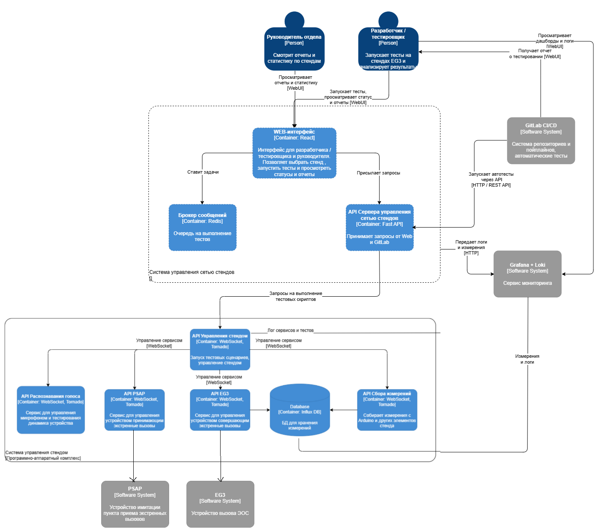
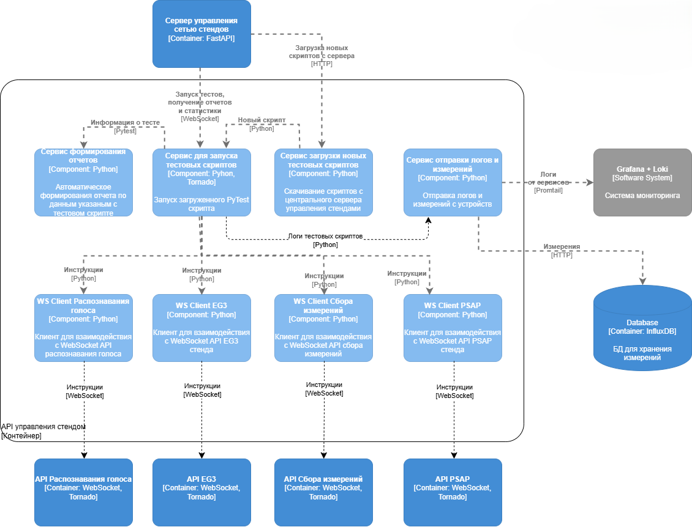
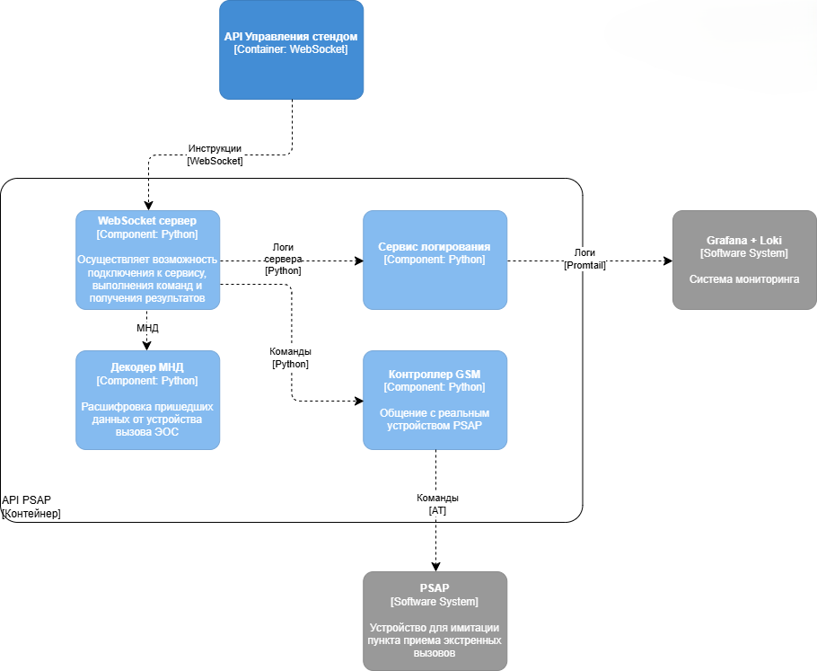
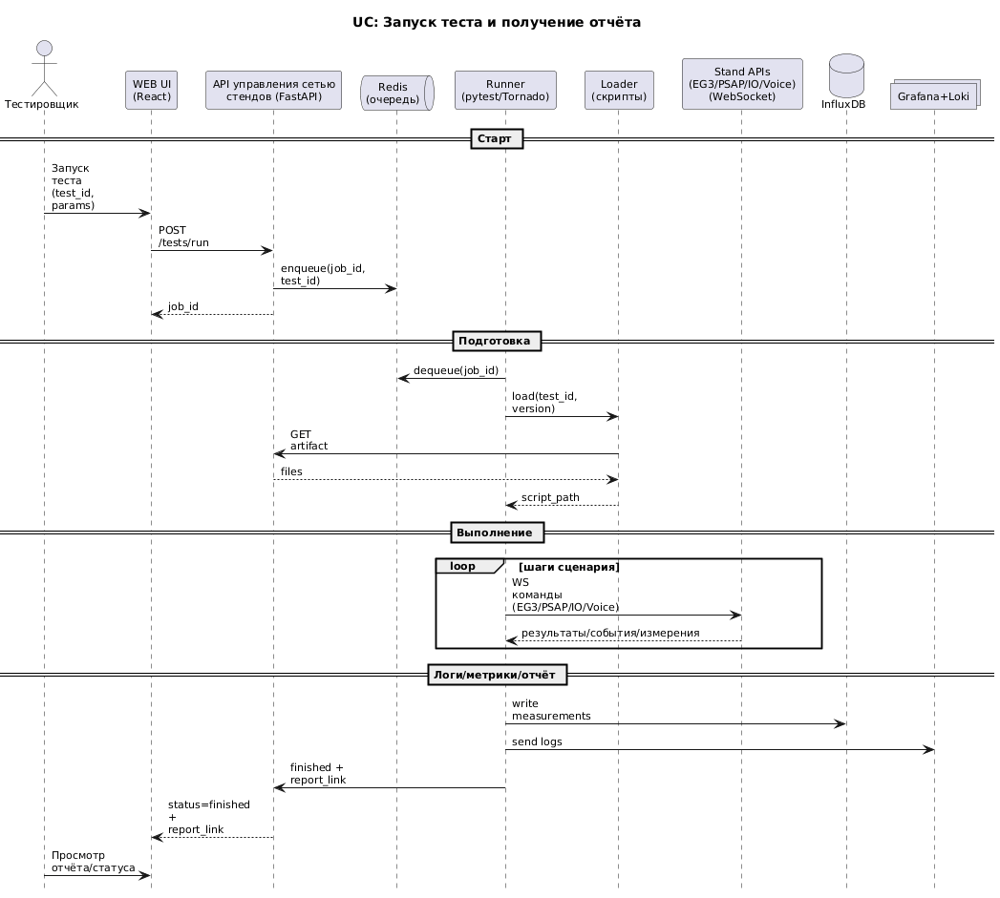
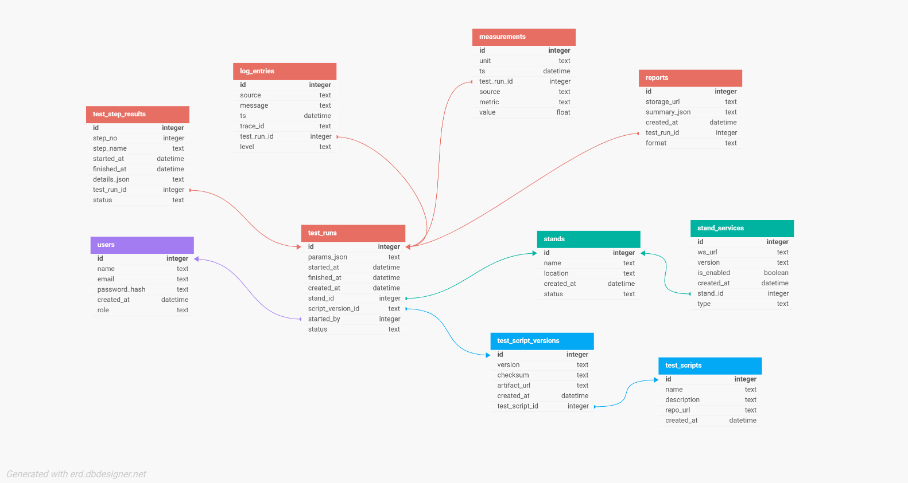

# Лабораторная работа №3
### Левин Михаил РИС-22-1
**Тема:** Использование принципов проектирования на уровне методов и классов
**Цель работы:** Получить опыт проектирования и реализации модулей с использованием принципов KISS, YAGNI, DRY, SOLID и др.
## Диаграммы компонентов и контейнеров
### Диаграмма контейнеров

### Диаграмма компонентов 1

### Диаграмма компонентов 2


## Диаграмма последовательностей
**Выбранный вариант использования:** Запуск теста устройства вызова экстренных-оперативных служб из WEB-интерфейса и получение отчёта/статуса выполнения.

**Сценарий работы:**   
Для начала тестировщик с помощью WEB UI выбирает нужный тест и запускает его. После этого его запрос отправляется в API управления сетью стендов. От туда он попадает в очередь Redis, где ему присваивается уникальный идентификатор для отслеживания.   
Далее компонент запуска тестов забирает задачу из очереди и получает актуальную версию выбранного тестового скрипта. И последовательно выполняет все приписаные инчтрукции и получает результаты.   
Во время выполнения тестов происходит общение с внутренними API стенда по WebSocket, а также отправка результатов, логов и измерений.   
После окончания теста происходит отправка результата а такде ссылка на отчет.



## Модель БД
В текущей верии системы не запланировано использование реляционных баз данных, однако можно в будующем добавить БД для хранения результатов тестирования, самих тестовых скриптов и информации о пользователях.

Предпологается, что для БД будет использоватся PostgreSQL


## Применение основных принципов разработки

### KISS
Протокол взаимодействия с сервисами реализован простым JSON-пакетом action + payload и унифицированным ответом, что минимизирует количество форматов и упрощает отладку (KISS).

Вот пример обработчика сообщений у PSAP API
```python
def on_message(self, message):
        try:
            data = json.loads(message)
            logger.info(f"Получено сообщение: {data}")
            action = data.get("action")

            if action == "hangup":
                psap.hangup()
                time.sleep(2)
                self.send_json({
                    "event": "hangup",
                    "reason": "request"
                })

            elif action == "hangup_timeout" and data.get("mode") == "set":
                timeout = int(data.get("timeout", 30))
                psap.set_hangup_timeout(timeout)
                self.send_json({
                    "event": "hangup_timeout",
                    "value": psap.hangup_timeout
                })

            elif action == "hangup_timeout" and data.get("mode") == "get":
                self.send_json({
                    "event": "hangup_timeout",
                    "value": psap.hangup_timeout
                })

            elif action == "get_status":
                self.send_json({
                    "event": "status",
                    **psap.get_status()
                })
                
            elif action == "play_dtmf_tone":
                tone = str(data.get("tone"))
                psap.play_dtmf_tone(tone)
                self.send_json({
                    "event": "dtmf_tone_played"
                })
                
            elif action == "repeat_msd_inband_request":
                psap.repeat_msd_inband_request()
                self.send_json({
                    "event": "repeat_msd_inband_request_sent"
                })

            elif action == "repeat_ecall_sms_request":
                psap.send_ecall_sms()
                self.send_json({
                    "event": "repeat_ecall_sms_request_sent"
                })

            elif action == "repeat_msd_sms_request":
                psap.repeat_msd_sms_request()
                self.send_json({
                    "event": "repeat_msd_sms_request_sent"
                })

            elif action == "network_deregistration_request":
                psap.network_deregistration_request()
                self.send_json({
                    "event": "network_deregistration_request_sent"
                })

            else:
                self.send_json({"error": "Unknown command"})
```

### YAGNI
Реализованы только операции, необходимые для автотестов стенда (управление EG3/PSAP/Arduino и сбор результатов). Не добавлялись заранее роли/сложные политики доступа/универсальные workflow-движки и расширенная модель данных — это снижает сложность и поддерживает принцип YAGNI.

### DRY
Повторяющиеся части вынесены в общие функции/модули: можно продемонстировать с помощью фикстур дял тестов которые позволяют автоматически выполнять определенный код до или после выполнения скрипта. Например для каждого скрипта можно отдельно подключить только нужные WS API.

```python
# Фиксуры
@pytest_asyncio.fixture
async def psap_client():
    c = AsyncPSAPClient(); await c.connect(); yield c; await c.close()

@pytest_asyncio.fixture
async def arduino_client():
    c = AsyncArduinoClient(); await c.connect(); yield c; await c.close()

@pytest_asyncio.fixture
async def eg3_client():
    c = AsyncEG3Client(); await c.connect(); yield c; await c.close()

@pytest_asyncio.fixture
async def speech_client():
    c = AsyncSpeechClient(); await c.connect(); yield c; await c.close()

# Подключение к тестовому скрипту
@pytest.mark.asyncio
@log_test_result
async def test_single_recognition_per_call(
    psap_client: AsyncPSAPClient, 
    arduino_client: AsyncArduinoClient,
    speech_client: AsyncSpeechClient,
):
    successes = 0

    hangup_event = await psap_client.set_hangup_timeout(timeout=100)
    logger.info(f"Установлен таймаут на 100 сек: {hangup_event}")
    ...
```

### SOLID

**S (Single Responsibility):** PSAP API отвечает за работу с PSAP, EG3 API только за работу с самим устройством и т.д. Можно увидеть по диаграммам компонентов, каждый из них решает собственную задачу.

**O (Open/Closed):** обработка событий расширяется без правки логики: wait_event принимает предикат, и новые типы событий добавляются через предикат, не меняя метод.

```python
async def wait_event(self, predicate: Callable[[dict], bool], timeout: float = 5.0) -> dict:
        try:
            while True:
                event = await asyncio.wait_for(self.incoming_queue.get(), timeout=timeout)
                if predicate(event):
                    return event
        except asyncio.TimeoutError:
            raise TimeoutError("Expected event timeout")
```

**L (Liskov Substitution):** ---

**I (Interface Segregation):** можно опять же привести в пример, что разные клиенты/фикстуры для разных подсистем, тесты подключают только то, что им нужно, а не «один гигантский клиент». Пример разнесения интерфейсов:

```python
@pytest_asyncio.fixture
async def psap_client():
    c = AsyncPSAPClient(); await c.connect(); yield c; await c.close()

@pytest_asyncio.fixture
async def arduino_client():
    c = AsyncArduinoClient(); await c.connect(); yield c; await c.close()

@pytest_asyncio.fixture
async def eg3_client():
    c = AsyncEG3Client(); await c.connect(); yield c; await c.close()

@pytest_asyncio.fixture
async def speech_client():
    c = AsyncSpeechClient(); await c.connect(); yield c; await c.close()
```

**D (Dependency Inversion):**PSAPController зависит не от конкретного WebSocket‑класса, а от абстракции (callable‑sender). WebSocket передает функцию отправки через set_ws_sender, а контроллер не знает, кто именно отправляет.

```python
def set_ws_sender(self, send_func):
        """Привязка функции отправки событий в WebSocket."""
        self.send_ws_message = send_func

class PSAPWebSocket(tornado.websocket.WebSocketHandler):
    def open(self):
        global active_connection
        if active_connection:
            self.write_message(json.dumps({
                "error": "Connection already active"
            }))
            self.close()
            return

        logger.info(f"WebSocket клиент подключился: {self.request.remote_ip}")
        active_connection = self

        # Привязка функции отправки событий от контроллера в WebSocket
        psap.set_ws_sender(self.send_json)
```