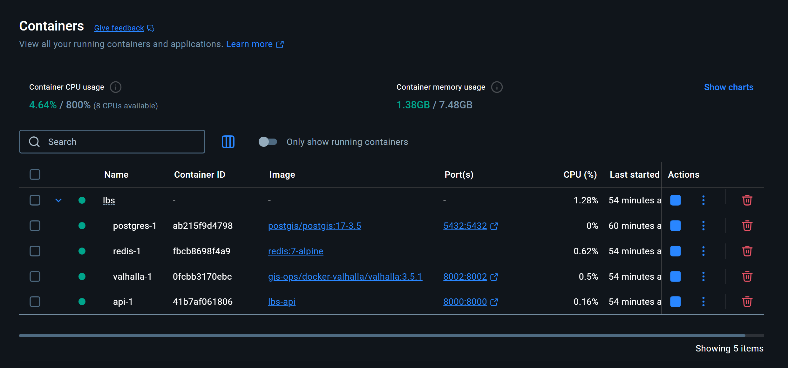
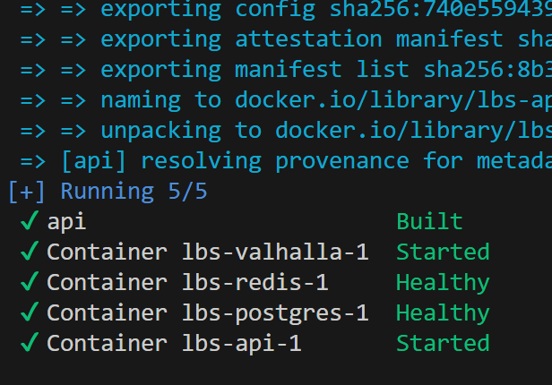
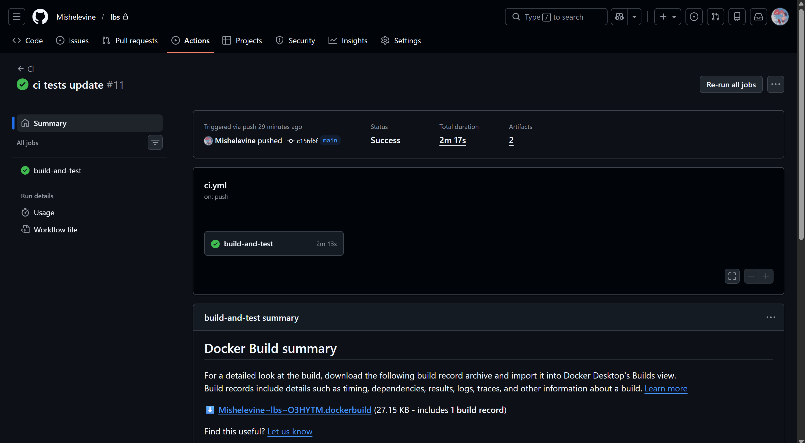
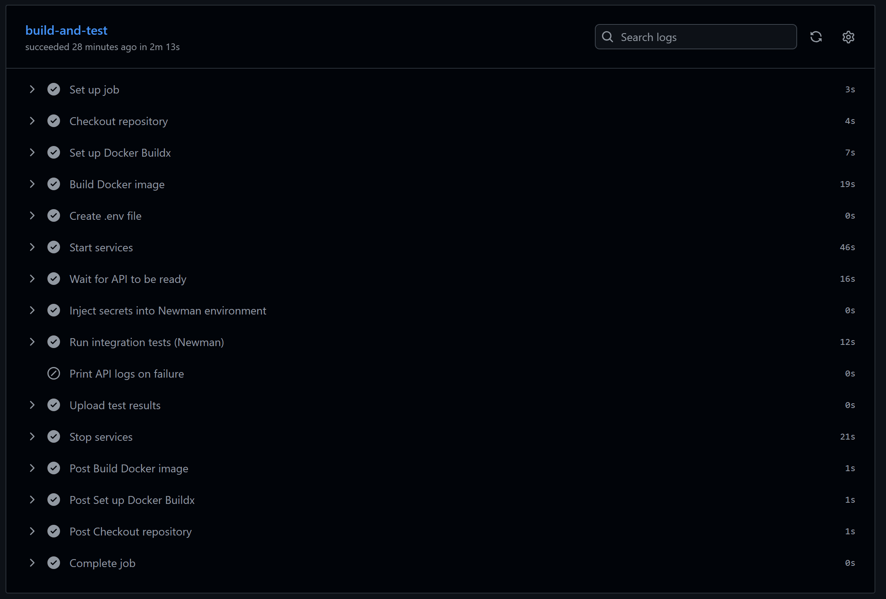
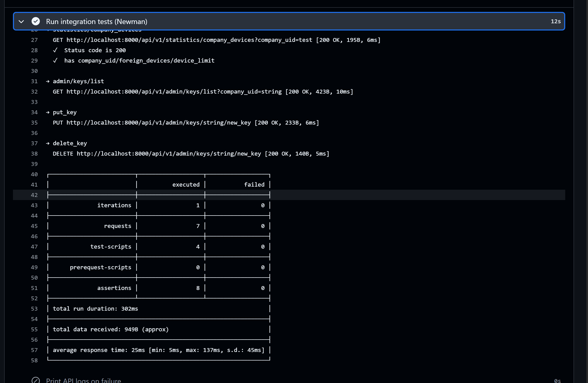

# Лабораторная работа №5
**Тема:** Реализация архитектуры на основе сервисов (микросервисной архитектуры)
**Цель:** Получить опыт организации взаимодействия сервисов с использованием контейнеров Docker

---

## 1. Контейнеры и их взаимодействие

### Состав контейнеров

В проекте используется четыре контейнера:

| Контейнер  | Образ                                          | Назначение |
|------------|------------------------------------------------|------------|
| `api`      | python:3.13-slim             | FastAPI-сервис: аутентификация по API-ключам, локализация по WiFi/GSM (kNN), map-matching через Valhalla, управление устройствами |
| `postgres` | postgis/postgis:17-3.5                         | PostgreSQL + PostGIS: хранение сигналов базовых станций, измерений, API-ключей, логов запросов |
| `redis`    | redis:7-alpine                                 | Хранение "хвостов" трека устройств (последние N точек по IMEI) для расчёта курса движения |
| `valhalla` | ghcr.io/gis-ops/docker-valhalla/valhalla:3.5.1 | Сервис map-matching: привязка GPS-координат к дорожному графу |

**Зависимости и порядок запуска:**

- `postgres` запускается первым; healthcheck (`pg_isready`) гарантирует готовность БД до старта `api`
- `redis` запускается независимо; healthcheck (`redis-cli ping`) аналогично
- `valhalla` запускается независимо, `api` ожидает его старта
- `api` стартует только после того, как `postgres` и `redis` перешли в статус `healthy`



### Dockerfile (серверная часть)

```dockerfile
FROM python:3.13-slim

WORKDIR /app

# Устанавливаем системные зависимости и менеджер пакетов uv
RUN apt-get update && apt-get install -y --no-install-recommends curl ca-certificates \
 && curl -LsSf https://astral.sh/uv/install.sh | sh \
 && rm -rf /var/lib/apt/lists/*

ENV PATH="/root/.local/bin:${PATH}"

# Копируем только манифесты зависимостей — слой кэшируется при изменении кода
COPY pyproject.toml uv.lock ./

# Устанавливаем только production-зависимости (без dev-инструментов)
RUN uv sync --frozen --no-dev

# Копируем весь исходный код
COPY . .

EXPOSE 8000

# Запуск: инициализация логирования, затем uvicorn
CMD ["sh", "-c", "uv run python -m app.logging.bootstrap_logging && uv run uvicorn app.main:app --host ${APP_HOST:-0.0.0.0} --port ${APP_PORT:-8000} --log-config ${LOG_CONFIG:-app/logging/logging_config.json}"]
```

### Docker Compose (профиль `local`)

```yaml
services:
  postgres:
    profiles: ["local"]
    image: postgis/postgis:17-3.5       # PostgreSQL 17 + PostGIS 3.5
    env_file: [.env]
    environment:
      POSTGRES_USER: ${DB_USER}
      POSTGRES_PASSWORD: ${DB_PASS}
      POSTGRES_DB: ${DB_NAME}
    ports:
      - "5432:5432"
    volumes:
      - postgres_data:/var/lib/postgresql/data          # постоянное хранилище
      - ./tests/station_types.sql:/docker-entrypoint-initdb.d/20_station_types.sql:ro
      - ./tests/dump.sql:/docker-entrypoint-initdb.d/dump.sql.gz:ro  # gzip-дамп
    healthcheck:
      test: ["CMD-SHELL", "pg_isready -U ${DB_USER} -d ${DB_NAME}"]
      interval: 10s
      timeout: 5s
      retries: 10

  api:
    profiles: ["local"]
    build: .                             # собирается из локального Dockerfile
    env_file: [.env]
    environment:
      DB_HOST: postgres                  # DNS-имя контейнера внутри Docker-сети
    ports:
      - "${API_PORT:-8000}:8000"
    volumes:
      - "${HOST_LOG_PATH}:/app/logs"
    depends_on:
      postgres:
        condition: service_healthy       # ждёт готовности БД
      redis:
        condition: service_healthy
      valhalla:
        condition: service_started

  redis:
    profiles: ["local"]
    image: redis:7-alpine
    command: ["redis-server", "--appendonly", "no"]
    healthcheck:
      test: ["CMD", "redis-cli", "ping"]
      interval: 10s
      retries: 10

  valhalla:
    profiles: ["local"]
    image: ghcr.io/gis-ops/docker-valhalla/valhalla:3.5.1
    volumes:
      - ./valhalla/custom_files:/custom_files  # тайлы дорожного графа
    ports:
      - "8002:8002"
    healthcheck:
      test: ["CMD", "wget", "-qO-", "http://localhost:8002/status"]
      interval: 20s
      retries: 30
```



---

## 2. Настройка непрерывной интеграции

Непрерывная интеграция реализована через **GitHub Actions** (`.github/workflows/ci.yml`). Пайплайн запускается автоматически при каждом push и pull request в ветку `main`.

### Шаги пайплайна

**1. Сборка Docker-образа**

Используется `docker/build-push-action` с кэшем GitHub Actions Cache (`type=gha`). Образ собирается без публикации — только для проверки корректности сборки.

```yaml
- name: Build Docker image
  uses: docker/build-push-action@v6
  with:
    context: .
    push: false
    tags: lbs-api:${{ github.sha }}
    cache-from: type=gha
    cache-to: type=gha,mode=max
```

**2. Создание конфигурации из секретов**

Переменные окружения (пароли БД, ключи шифрования) хранятся в GitHub Secrets и подставляются в `.env` при каждом запуске.

```yaml
- name: Create .env file
  run: |
    cat > .env <<EOF
    DB_USER=${{ secrets.DB_USER }}
    DB_PASS=${{ secrets.DB_PASS }}
    ...
    EOF
```

**3. Запуск стека и ожидание готовности**

```yaml
- name: Start services
  run: docker compose --profile local up -d --build

- name: Wait for API to be ready
  run: |
    for i in $(seq 1 30); do
      if curl -sf http://localhost:8000/health; then break; fi
      sleep 5
    done
```

API объявляет себя готовым только после полной инициализации, в том числе загрузки kNN-модели.

**4. Прогон тестов**

```yaml
- name: Run integration tests (Newman)
  run: |
    npx --yes newman run tests/collection.json \
      -e tests/env_ci.json \
      --reporters cli,junit \
      --reporter-junit-export tests/results.xml
```

**5. Сохранение результатов**






---

## 3. Подключение тестов из Postman

### Экспорт коллекции

Тесты написаны в **Postman** и экспортированы в файлы:
- `tests/collection.json` — коллекция запросов с тестовыми скриптами (JavaScript)
- `tests/env.json` — окружение с переменными `lbs_api_key` и `lbs_admin_key`

Каждый запрос содержит assertions в блоке `pm.test(...)`, например:

```javascript
pm.test("Status code is 200", () => pm.response.to.have.status(200));
pm.test("has lat/lon/accuracy/source", () => {
  const j = pm.response.json();
  pm.expect(j).to.have.property("lat");
  pm.expect(j).to.have.property("lon");
});
```

### Покрытие тестами

| Запрос | Метод | Что проверяется |
|--------|-------|-----------------|
| `get_data_wifi` | POST | Локализация по WiFi — статус 200, наличие lat/lon/accuracy/source |
| `get_data_gsm` | POST | Локализация по GSM |
| `get_data_yandex` | POST | Локализация через Yandex Locator |
| `put_data` | POST | Запись измерения — статус 200 |
| `admin/keys/create` | POST | Создание API-ключа — статус 200, поля api_key и usage |
| `statistics/key_usage` | GET | Статистика использования ключа |
| `statistics/company_devices` | GET | Список устройств компании |
| `admin/keys/list` | GET | Список ключей компании |
| `put_key` | PUT | Обновление лимитов ключа |
| `delete_key` | DELETE | Удаление ключа |

### Подстановка секретов в CI

В CI API-ключи берутся из GitHub Secrets и подставляются через `jq`:

```yaml
- name: Inject secrets into Newman environment
  run: |
    jq \
      --arg api_key "${{ secrets.LBS_API_KEY }}" \
      --arg admin_key "${{ secrets.LBS_ADMIN_KEY }}" \
      '.values = (.values | map(
        if .key == "lbs_api_key" then .value = $api_key
        elif .key == "lbs_admin_key" then .value = $admin_key
        else . end
      ))' \
      tests/env.json > tests/env_ci.json
```

### Запуск через Newman

Newman — CLI-runner для Postman-коллекций, устанавливается через `npx` без предварительной установки:

```bash
npx newman run tests/collection.json \
  -e tests/env_ci.json \
  --reporters cli,junit \
  --reporter-junit-export tests/results.xml
```


