# Лабораторная работа №6
### Левин Михаил РИС-22-1
**Тема:** Использование шаблонов проектирования
**Цель работы:** Получить опыт применения шаблонов проектирования при написании кода программной системы.

---

## Шаблоны проектирования GoF

# Порождающие шаблоны

## 1. Singleton

**Общее назначение:** Гарантирует, что класс имеет только один экземпляр, и предоставляет глобальную точку доступа к нему. Применяется, когда нужно контролировать создание дорогостоящего ресурса и обеспечить единый доступ к нему из любой части программы.

**Назначение в проекте LBS:** Модели kNN-локализации (`KnnMatrixCache`) создаются по одному экземпляру для Wi-Fi и GSM на уровне модуля. Это гарантирует, что матрица сигналов загружается в память один раз и используется совместно всеми запросами без повторного построения.

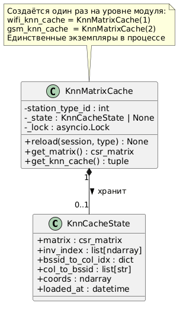

```python
# app/services/knn_localizer.py

class KnnMatrixCache:
    def __init__(self, station_type_id: int):
        self.station_type_id = station_type_id
        self._state: Optional[KnnCacheState] = None
        self._lock = asyncio.Lock()

    def get_knn_cache(self):
        state = self._state  # атомарное чтение - всегда согласованное состояние
        if state is None:
            raise ModelNotReady("knn_cache_not_ready")
        return state.matrix, state.inv_index, state.bssid_to_col_idx, \
               state.col_to_bssid, state.coords

# Единственные глобальные экземпляры - создаются один раз при старте приложения
wifi_knn_cache = KnnMatrixCache(station_type_id=1)  # Wi-Fi
gsm_knn_cache = KnnMatrixCache(station_type_id=2)   # GSM
```

---

## 2. Фабричный метод (Factory Method)

**Общее назначение:** Определяет интерфейс для создания объекта, но позволяет подклассам решать, какой конкретный класс инстанцировать. Делегирует создание объекта подклассам, скрывая детали конструирования от клиентского кода.

**Назначение в проекте LBS:** Создание кэшей `KnnMatrixCache` для разных типов станций (Wi-Fi / GSM) вынесено в фабрику. Абстрактный `LocalizerFactory` объявляет методы `create_cache()` и `create_localizer()`, а конкретные фабрики `WiFiLocalizerFactory` и `GsmLocalizerFactory` реализуют их с нужными параметрами.

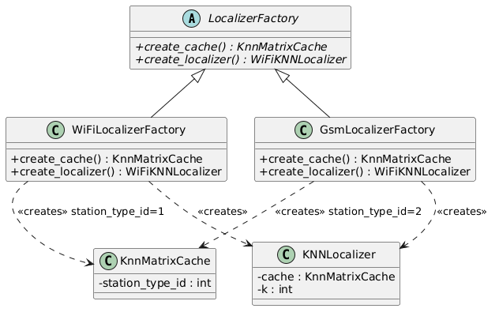

```python
# app/services/knn_localizer.py

from abc import ABC, abstractmethod

class LocalizerFactory(ABC):
    """Creator: объявляет фабричный метод создания локализатора."""

    @abstractmethod
    def create_cache(self) -> KnnMatrixCache:
        pass

    @abstractmethod
    def create_localizer(self) -> KNNLocalizer:
        pass

class WiFiLocalizerFactory(LocalizerFactory):
    """ConcreteCreator: создаёт компоненты Wi-Fi локализатора."""

    def create_cache(self) -> KnnMatrixCache:
        return KnnMatrixCache(station_type_id=1)

    def create_localizer(self) -> KNNLocalizer:
        cache = self.create_cache()
        return KNNLocalizer(cache=cache, k=5)

class GsmLocalizerFactory(LocalizerFactory):
    """ConcreteCreator: создаёт компоненты GSM локализатора."""

    def create_cache(self) -> KnnMatrixCache:
        return KnnMatrixCache(station_type_id=2)

    def create_localizer(self) -> KNNLocalizer:
        cache = self.create_cache()
        return KNNLocalizer(cache=cache, k=5)

# Использование (заменяет прямое создание в модуле):
wifi_localizer = WiFiLocalizerFactory().create_localizer()
gsm_localizer  = GsmLocalizerFactory().create_localizer()
```

---

## 3. Builder

**Общее назначение:** Отделяет конструирование сложного объекта от его представления. Позволяет создавать один и тот же тип объекта различными способами, поэтапно задавая параметры через fluent-интерфейс.

**Назначение в проекте LBS:** Объект `GetDataOut` (ответ эндпоинта) собирается поэтапно в зависимости от результатов локализации: сначала устанавливаются координаты и точность, затем источник, затем дополнительный суффикс `source_info` при map-matching. Паттерн Builder формализует этот процесс пошагового конструирования ответа.

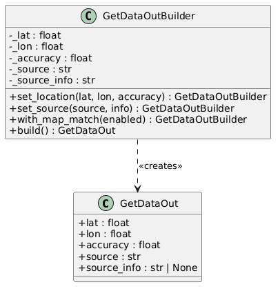

```python
# app/schemas.py

class GetDataOut(BaseModel):
    lat: float
    lon: float
    accuracy: float
    source: Literal["wifi_local", "gsm_local", "yandex"]
    source_info: Optional[str] = None

# app/api/v1/get_data.py

class GetDataOutBuilder:
    """Builder: пошаговое конструирование ответа локализации."""

    def __init__(self):
        self._lat = 0.0
        self._lon = 0.0
        self._accuracy = 0.0
        self._source = "wifi_local"
        self._source_info = ""

    def set_location(self, lat: float, lon: float, accuracy: float) -> "GetDataOutBuilder":
        self._lat, self._lon, self._accuracy = lat, lon, accuracy
        return self

    def set_source(self, source: str, info: str) -> "GetDataOutBuilder":
        self._source = source
        self._source_info = info
        return self

    def with_map_match(self, enabled: bool) -> "GetDataOutBuilder":
        if enabled:
            self._source_info += "+mm_trace/locate"
        return self

    def build(self) -> GetDataOut:
        return GetDataOut(
            lat=self._lat,
            lon=self._lon,
            accuracy=self._accuracy,
            source=self._source,
            source_info=self._source_info,
        )

result = (
    GetDataOutBuilder()
    .set_location(lat, lon, acc)
    .set_source("wifi_local", "model_ready:wifi")
    .with_map_match(payload.map_match)
    .build()
)
```

---

# Структурные шаблоны

## 1. Facade

**Общее назначение:** Предоставляет упрощённый интерфейс к сложной подсистеме, скрывая детали её реализации. Снижает связность между клиентом и подсистемой.

**Назначение в проекте LBS:** Функция `_process_get_data_single()` является фасадом: за единым вызовом она скрывает взаимодействие с kNN-локализатором, Yandex Locator, сервисом квот, map-matching (Valhalla), Redis-хвостом и логированием. Клиентский эндпоинт обращается к одной функции вместо оркестрации шести подсистем.

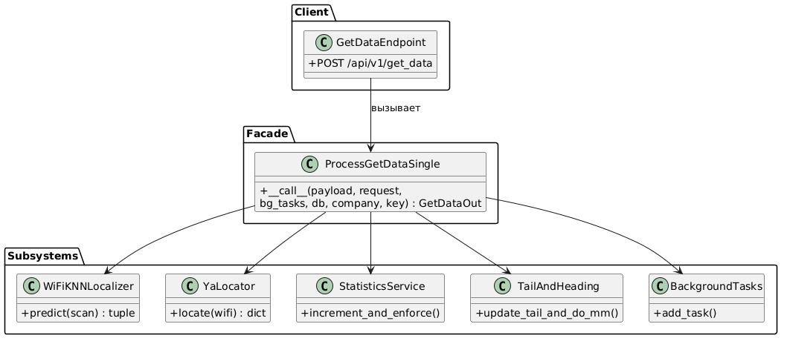

```python
# app/api/v1/get_data.py

async def _process_get_data_single(
    payload: GetDataIn,
    request: Request,
    background_tasks: BackgroundTasks,
    db: AsyncSession,
    company,
    key_name: str,
) -> GetDataOut:
    """
    Фасад: за единым интерфейсом скрыта вся логика get_data.
    """
    wifi_scan = [(s.bssid, s.rssi) for s in payload.signals if s.station_type_id == 1]
    gsm_scan  = [(s.bssid, s.rssi) for s in payload.signals if s.station_type_id == 2]

    # 1. Локализация (стратегия выбирается по provider_mode)
    if payload.provider_mode == ProviderMode.yandex_only:
        await increment_and_enforce(db, company.id, key_name, "yandex")
        lat, lon, acc, src = await _call_yandex(wifi_scan)
    else:
        lat, lon, acc = await _try_local(wifi_knn_cache, wifi_localizer, wifi_scan)
        src = "wifi_local"

    # 2. Map-matching + обновление хвоста/курса
    lat, lon, _heading = await update_tail_and_do_mm(
        payload.device_imei, lat, lon, do_mm=payload.map_match
    )

    # 3. Асинхронное логирование (не блокирует ответ)
    background_tasks.add_task(_log_usage_bg, company.id, key_name,
                               request.url.path, src, payload.device_imei, payload.timestamp)

    # 4. Формирование ответа
    return GetDataOut(lat=lat, lon=lon, accuracy=acc, source=src,
                      source_info="..." + ("+mm_trace/locate" if payload.map_match else ""))
```

---

## 2. Adapter

**Общее назначение:** Преобразует интерфейс одного класса в интерфейс, ожидаемый клиентским кодом. Позволяет несовместимым классам работать вместе, не изменяя их исходный код.

**Назначение в проекте LBS:** `YaLocator` адаптирует внешний HTTP API Yandex Locator к внутреннему интерфейсу сервиса. Он также нормализует различные форматы BSSID (десятичный, hex, MAC с разделителями) в единый формат `AA:BB:CC:DD:EE:FF`, требуемый Yandex API.

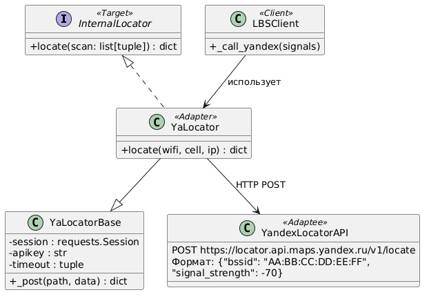

```python
# app/services/ya_locator.py

def normalize_bssid(bsid: str) -> str:
    """Адаптирует различные форматы BSSID к формату AA:BB:CC:DD:EE:FF."""
    s = bsid.strip().lower()
    if s.isdigit():                      # десятичное число -> MAC
        return _int_to_mac_hex(int(s, 10))
    if s.startswith("0x"):               # 0x... -> MAC
        return _int_to_mac_hex(int(s, 16))
    if ":" in s or "-" in s:             # с разделителями -> MAC
        s2 = s.replace(":", "").replace("-", "")
        if _HEX_RE.fullmatch(s2):
            return _int_to_mac_hex(int(s2, 16))
    if _HEX_RE.fullmatch(s):             # 12 hex без разделителей -> MAC
        return _int_to_mac_hex(int(s, 16))
    return bsid

def build_wifi_payload(scan: Iterable[Tuple[str, float]]) -> List[Dict[str, Any]]:
    """Адаптирует внутренний формат сканирования к формату Yandex API."""
    return [
        {"bssid": normalize_bssid(str(bssid)), "signal_strength": int(round(float(rssi)))}
        for bssid, rssi in scan
    ]

class YaLocator(YaLocatorBase):
    def locate(self, wifi=None, cell=None, ip=None) -> Dict[str, Any]:
        """Единый метод вместо прямых HTTP-вызовов к Yandex API."""
        payload: Dict[str, Any] = {}
        if wifi: payload["wifi"] = wifi
        if cell: payload["cell"] = cell
        if ip:   payload["ip"]   = ip
        return self._post("locate", payload)
```

---

## 3. Proxy (protection)

**Общее назначение:** Предоставляет объект-заместитель, который контролирует доступ к другому объекту. Прокси имеет тот же интерфейс, что и реальный объект, и может выполнять дополнительные действия до/после обращения к нему.

**Назначение в проекте LBS:** FastAPI-зависимость `require_company_and_key` является защитным прокси перед всеми эндпоинтами: она расшифровывает API-ключ, проверяет существование компании, проверяет наличие ключа в базе данных, и только при успешной проверке передаёт управление реальному обработчику.

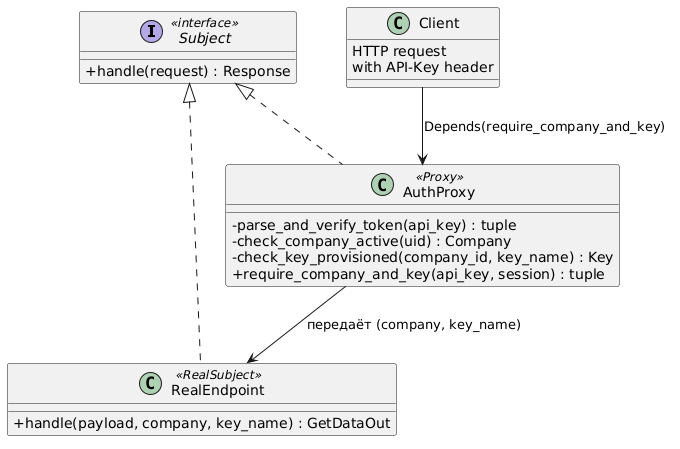

```python
# app/auth.py

async def require_company_and_key(
    api_key: str | None = Header(None, alias="API-Key"),
    session: AsyncSession = Depends(get_session),
):
    """
    Прокси: перехватывает запрос, проверяет авторизацию
    и только при успехе передаёт управление реальному эндпоинту.
    """
    if not api_key:
        raise HTTPException(HTTP_401_UNAUTHORIZED, "Missing API-Key")

    # 1. Расшифровка токена
    uid, key_name = parse_and_verify_token(api_key)

    # 2. Проверка компании
    comp = (await session.execute(
        select(Company).where(Company.company_uid == uid)
    )).scalar_one_or_none()
    if not comp or not comp.is_active:
        raise HTTPException(HTTP_403_FORBIDDEN, "Company disabled or not found")

    # 3. Проверка ключа
    quota = (await session.execute(
        select(Key).where(Key.company_id == comp.id, Key.key_name == key_name)
    )).scalar_one_or_none()
    if not quota:
        raise HTTPException(HTTP_403_FORBIDDEN, "Key not provisioned")

    return comp, key_name, quota  # передаёт данные реальному эндпоинту

# Использование прокси
@router.post("/get_data")
async def get_data(auth=Depends(require_company_and_key)):
    company, key_name, _ = auth
    ...
```

---

## 4. Decorator

**Общее назначение:** Динамически добавляет объекту новые обязанности, не изменяя его класс. Является гибкой альтернативой наследованию для расширения функциональности.

**Назначение в проекте LBS:** Зависимость `log_request_body` декорирует все роуты API-роутера, добавляя к ним логирование входящих запросов. Ни один обработчик эндпоинта не знает о логировании — оно прозрачно добавляется через механизм `Depends` на уровне роутера.

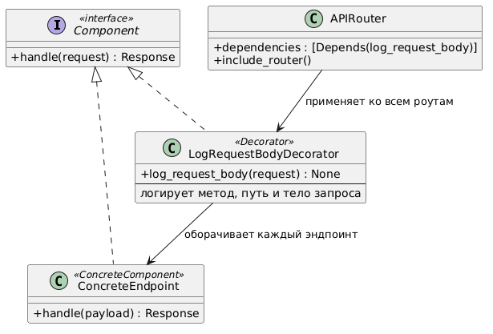

```python
# app/api/v1/router.py

async def log_request_body(request: Request) -> None:
    """
    Декоратор: добавляет логирование к любому эндпоинту
    без изменения его кода.
    """
    body = await request.body()
    try:
        body_str = body.decode("utf-8")
    except UnicodeDecodeError:
        body_str = repr(body)

    access_logger.info(
        "incoming %s %s body=%s",
        request.method,
        request.url.path,
        body_str,
    )

access_logger = get_general_logger("api.requests")

# Декоратор применяется ко всем роутам через dependencies:
router = APIRouter(
    prefix="/api/v1",
    tags=["v1"],
    dependencies=[Depends(log_request_body)],  # прозрачное декорирование
)
```

---

# Поведенческие шаблоны

## 1. Strategy

**Общее назначение:** Определяет семейство взаимозаменяемых алгоритмов, инкапсулирует каждый из них и делает их взаимозаменяемыми. Позволяет изменять алгоритм независимо от клиентов, которые его используют.

**Назначение в проекте LBS:** Перечисление `ProviderMode` задаёт стратегию локализации: `yandex_only`, `wifi_only`, `gsm_only`, `local_only`, `auto_on_low_overlap`. Каждый режим - отдельная стратегия с собственным алгоритмом. Клиент передаёт выбранный режим в запросе, а контекст (`_process_get_data_single`) делегирует выполнение соответствующей стратегии.

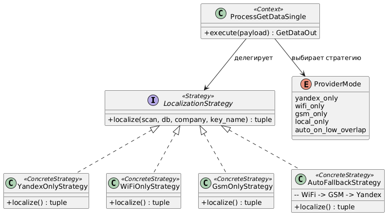

```python
# app/schemas.py

class ProviderMode(str, Enum):
    local_only           = "local_only"           # только локальная модель
    auto_on_low_overlap  = "auto_on_low_overlap"  # Яндекс при нехватке пересечений
    yandex_only          = "yandex_only"          # только Яндекс
    wifi_only            = "wifi_only"            # только Wi-Fi kNN
    gsm_only             = "gsm_only"             # только GSM kNN

# app/api/v1/get_data.py — контекст выбирает стратегию по значению ProviderMode:

if payload.provider_mode == ProviderMode.yandex_only:    # Стратегия 1
    lat, lon, acc, src = await _call_yandex(wifi_scan)

elif payload.provider_mode == ProviderMode.wifi_only:    # Стратегия 2
    lat, lon, acc = await _predict_only("wifi", wifi_knn_cache, wifi_localizer, wifi_scan)

elif payload.provider_mode == ProviderMode.gsm_only:     # Стратегия 3
    lat, lon, acc = await _predict_only("gsm", gsm_knn_cache, gsm_localizer, gsm_scan)

else:                                                    # Стратегия 4/5: auto/local_only
    lat, lon, acc = await _try_local(wifi_knn_cache, wifi_localizer, wifi_scan)
    # ... с fallback на GSM и Яндекс при необходимости
```

---

## 2. Chain of Responsibility

**Общее назначение:** Позволяет передавать запрос по цепочке обработчиков. Каждый обработчик решает, обработать запрос самому или передать его следующему в цепочке.

**Назначение в проекте LBS:** При автоматическом режиме локализации запрос проходит через цепочку обработчиков: сначала Wi-Fi kNN, при неудаче — GSM kNN, при неудаче — Yandex Locator. Каждое звено либо возвращает результат, либо передаёт запрос следующему, перехватывая специфические исключения.

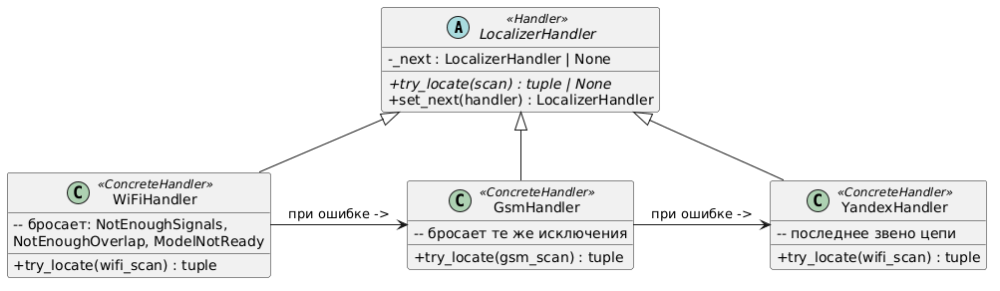

```python
# app/api/v1/get_data.py  (режим auto_on_low_overlap / local_only)

try:
    # Звено 1: Wi-Fi kNN
    lat, lon, acc = await _try_local(wifi_knn_cache, wifi_localizer, wifi_scan)
    src = "wifi_local"
    src_info = "model_ready:wifi"

except (NotEnoughSignals, NotEnoughOverlap, LowConfidence, ModelNotReady) as wifi_err:
    # Звено 2: GSM kNN — передача при неудаче Wi-Fi
    src_info = f"fallback:gsm_after_wifi_fail:{type(wifi_err).__name__}"
    try:
        lat, lon, acc = await _try_local(gsm_knn_cache, gsm_localizer, gsm_scan)
        src = "gsm_local"

    except tuple(_GSM_ERROR_MAP) as gsm_err:
        # Звено 3: Yandex — передача при неудаче GSM
        if payload.provider_mode == ProviderMode.auto_on_low_overlap and wifi_scan:
            lat, lon, acc, src, src_info = await _try_yandex_fallback(
                db, company.id, key_name, wifi_scan,
                f"fallback:yandex_after_gsm_fail:{type(gsm_err).__name__}"
            )
        else:
            raise _make_http_error(status, code, msg)
```

---

## 3. Observer

**Общее назначение:** Определяет зависимость «один ко многим» между объектами, при которой изменение состояния одного объекта приводит к автоматическому уведомлению и обновлению всех зависимых объектов.

**Назначение в проекте LBS:** По завершении локализации `BackgroundTasks` уведомляет наблюдателей: `_log_usage_bg` асинхронно записывает лог в БД, `_cache_yandex` сохраняет результат Яндекса обратно в базу измерений. Наблюдатели выполняются в фоне и не блокируют HTTP-ответ.

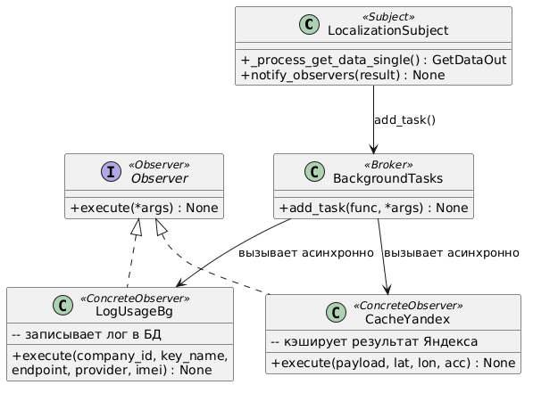

```python
# app/api/v1/get_data.py

async def _log_usage_bg(
    company_id: int, key_name: str, endpoint: str,
    provider: str, device_imei: str | None, ts: datetime | None = None,
) -> None:
    """Наблюдатель 1: асинхронная запись лога использования в БД."""
    async with async_session() as session:
        await write_usage_log(session, company_id, key_name, endpoint,
                              provider, device_imei, ts)
        await session.commit()

async def _cache_yandex(request_payload, lat, lon, acc) -> None:
    """Наблюдатель 2: кэширование точного ответа Яндекса в базу измерений."""
    min_acc = getattr(settings, "YANDEX_MIN_CACHE_ACCURACY", None)
    if min_acc and acc <= float(min_acc):
        async with async_session() as session:
            await put_one(put_payload, session)

# Регистрация наблюдателей после завершения локализации:
background_tasks.add_task(
    _log_usage_bg,
    company.id, key_name, request.url.path, src, payload.device_imei, payload.timestamp,
)
background_tasks.add_task(_cache_yandex, payload, lat, lon, acc)
```

---

## 4. State

**Общее назначение:** Позволяет объекту изменять своё поведение в зависимости от внутреннего состояния. Объект ведёт себя так, как будто меняет свой класс.

**Назначение в проекте LBS:** `KnnMatrixCache` имеет два состояния: `None` (модель не загружена) и `KnnCacheState` (модель готова). В состоянии `None` любой запрос к кэшу выбрасывает `ModelNotReady`. В состоянии `KnnCacheState` возвращаются матрица и индексы. Переход между состояниями осуществляет метод `reload()`.

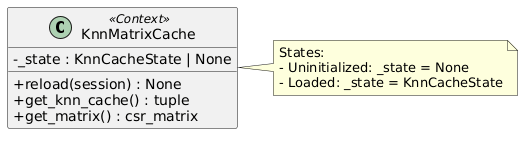

```python
# app/services/knn_localizer.py

class KnnCacheState(NamedTuple):
    matrix: csr_matrix
    inv_index: list[np.ndarray]
    bssid_to_col_idx: dict[str, int]
    col_to_bssid: list[str]
    coords: np.ndarray
    loaded_at: datetime

class KnnMatrixCache:
    def __init__(self, station_type_id: int):
        self._state: Optional[KnnCacheState] = None  # начальное состояние: не загружено

    def get_knn_cache(self):
        state = self._state
        if state is None:
            raise ModelNotReady("knn_cache_not_ready")  # поведение в состоянии Uninit
        return state.matrix, state.inv_index, state.bssid_to_col_idx, \
               state.col_to_bssid, state.coords  # поведение в состоянии Loaded

    async def reload(self, session, type: str):
        """Переход в состояние Loaded (или исключение при пустом датасете)."""
        async with self._lock:
            df = await load_training_df(session, ...)
            if df.empty:
                raise ModelNotReady(f"no_training_rows, type={type}")  # остаётся Uninit
            matrix, inv_index, bssid_to_col_idx, col_to_bssid, coords = \
                await anyio.to_thread.run_sync(build)
            self._state = KnnCacheState(...)  # переход в Loaded
```

---

## 5. Template Method

**Общее назначение:** Определяет скелет алгоритма в базовом классе, откладывая реализацию некоторых шагов на подклассы. Позволяет подклассам переопределять отдельные шаги алгоритма, не изменяя его структуру.

**Назначение в проекте LBS:** Метод `KnnMatrixCache.reload()` задаёт каркас алгоритма построения модели: блокировка -> загрузка данных -> построение матрицы -> нормализация -> обновление состояния. Шаг нормализации RSSI является «хуком», поведение которого различается для Wi-Fi (диапазон −100..0 dBm) и GSM (диапазон 0..63).

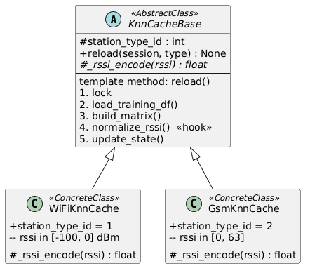

```python
# app/services/knn_localizer.py

async def reload(self, session: AsyncSession, type: str) -> None:
    """
    Шаблонный метод: определяет каркас алгоритма построения модели.
    Конкретные шаги (диапазон RSSI, фильтр данных) задаются через station_type_id.
    """
    async with self._lock:
        # Шаг 1: Загрузка обучающих данных
        df = await load_training_df(
            session,
            station_type_id=self.station_type_id,  # хук: Wi-Fi или GSM
            days_back=MAX_DAYS_BACK,
            min_seen_count=MIN_SEEN_COUNT,
        )
        if df.empty:
            raise ModelNotReady(f"no_training_rows, type={type}")

        def build():
            # Шаг 2: Построение разреженной матрицы (одинаково для всех типов)
            X = coo_matrix((rssi, (rows, cols)), ...).tocsr()

            # Шаг 3: Нормализация RSSI — хук, зависящий от типа станции
            if self.station_type_id == 2:   # GSM: 0..63
                rssi = np.clip(rssi, 0.0, 63.0) * (100.0 / 63.0)
            else:                           # Wi-Fi: -100..0 dBm
                rssi = np.clip(rssi, -100.0, 0.0) + 100.0

            # Шаг 4: L2-нормализация строк матрицы (одинаково для всех типов)
            X = normalize(X, norm="l2", axis=1)
            return X, inv_index, bssid_to_col_idx, col_to_bssid, coords

        # Шаг 5: Построение матрицы в отдельном потоке
        matrix, *rest = await anyio.to_thread.run_sync(build)

        # Шаг 6: Обновление состояния
        self._state = KnnCacheState(matrix, *rest, datetime.utcnow())
```

---

# Шаблоны проектирования GRASP

## Роли (обязанности) классов

### 1. Information Expert

**Проблема:** Кто должен отвечать за предоставление данных kNN-модели?

**Решение:** Класс `KnnMatrixCache` является информационным экспертом: он единственный, кто хранит всю информацию о состоянии модели (`KnnCacheState`) и несёт ответственность за её предоставление и обновление.

```python
# app/services/knn_localizer.py

class KnnMatrixCache:
    """Information Expert: хранит и предоставляет все данные kNN-модели."""

    def get_knn_cache(self):
        state = self._state
        if state is None:
            raise ModelNotReady("knn_cache_not_ready")
        # Эксперт знает, какие именно данные нужны локализатору
        return state.matrix, state.inv_index, state.bssid_to_col_idx, \
               state.col_to_bssid, state.coords

    @property
    def loaded_at(self) -> Optional[datetime]:
        state = self._state
        return state.loaded_at if state is not None else None
```

**Результаты:** Данные хранятся и предоставляются из единого места. Исключается дублирование логики доступа к модели по всему коду.

**Связь с другими паттернами:** Реализует паттерн Singleton (единственный экземпляр) и паттерн State (управляет состоянием модели).

---

### 2. Creator

**Проблема:** Кто должен создавать объекты `KnnCacheState`, содержащие обученную модель?

**Решение:** По правилу Creator, создатель объекта — тот, кто агрегирует или использует созданный объект. `KnnMatrixCache.reload()` создаёт `KnnCacheState`, так как именно он владеет всеми данными для его инициализации (матрица, индекс, координаты).

```python
# app/services/knn_localizer.py

class KnnMatrixCache:
    async def reload(self, session: AsyncSession, type: str) -> None:
        """Creator: создаёт KnnCacheState из обучающих данных."""
        # ... построение матрицы ...
        self._state = KnnCacheState(        # создание объекта-состояния
            matrix,
            inv_index,
            bssid_to_col_idx,
            col_to_bssid,
            coords,
            datetime.utcnow(),
        )
```

**Результаты:** Ответственность за создание `KnnCacheState` сосредоточена в одном месте. Снижается связность: клиентский код не знает о деталях конструирования модели.

**Связь с другими паттернами:** Реализует паттерн Template (структуру создания задаёт `reload()`) и State (переводит кэш в состояние Loaded).

---

### 3. Controller

**Проблема:** Кто должен принимать и координировать системные операции при запросе локализации?

**Решение:** Функция `_process_get_data_single()` выступает контроллером: она получает запрос от HTTP-слоя, координирует работу всех сервисов (локализация, квоты, map-matching, логирование) и формирует ответ.

```python
# app/api/v1/get_data.py

async def _process_get_data_single(
    payload: GetDataIn,
    request: Request,
    background_tasks: BackgroundTasks,
    db: AsyncSession,
    company,
    key_name: str,
) -> GetDataOut:
    """
    Controller: принимает системный запрос локализации
    и координирует работу подсистем.
    """
    # 1. Координирует выбор стратегии локализации
    # 2. Координирует проверку квот
    # 3. Координирует map-matching
    # 4. Координирует фоновое логирование
    ...
```

**Результаты:** HTTP-слой (эндпоинт) остаётся тонким. Бизнес-логика сосредоточена в контроллере, а не размазана по обработчикам запросов.

**Связь с другими паттернами:** Реализует паттерн Фасад (скрывает подсистемы) и использует паттерн Стратегия (делегирует алгоритм локализации).

---

### 4. Low Coupling

**Проблема:** Как минимизировать зависимость системы от внешнего Yandex Locator API, чтобы его замена не затронула остальной код?

**Решение:** `YaLocator` инкапсулирует всё взаимодействие с внешним API. Остальная система зависит только от функций `build_wifi_payload()` и `_call_yandex()` — не от Yandex API напрямую.

```python
# app/services/ya_locator.py

class YaLocator(YaLocatorBase):
    """Low Coupling: изолирует зависимость от Yandex API."""

    def locate(self, wifi=None, cell=None, ip=None) -> Dict[str, Any]:
        payload = {}
        if wifi: payload["wifi"] = wifi
        return self._post("locate", payload)

# app/api/v1/get_data.py — вся система видит только это:
def _do_request():
    client = YaLocator(settings.YANDEX_LOCATOR_API_KEY)
    return client.locate(wifi=wifi_req)
```

**Результаты:** Замена Yandex API на другой геолокационный сервис требует изменений только в `YaLocator` и `build_wifi_payload`, не затрагивая логику эндпоинтов.

**Связь с другими паттернами:** Реализует паттерн Адаптер (адаптирует внешний API) и принцип Protected Variations.

---

### 5. High Cohesion

**Проблема:** Как не допустить, чтобы логика работы со статистикой и квотами была разбросана по разным модулям системы?

**Решение:** Модуль `app/services/statistics.py` обладает высокой связностью (High Cohesion): он содержит только функции, связанные со статистикой использования (`increment_and_enforce`, `write_usage_log`), и больше ничем не занимается.

```python
# app/services/statistics.py

async def increment_and_enforce(
    session: AsyncSession, company_id: int, key_name: str, provider: str
):
    """Увеличивает счётчик запросов и проверяет квоту."""
    count_col, max_col = _cols(provider)
    row = (await session.execute(text(f"""
        UPDATE keys SET {count_col} = {count_col} + 1
        WHERE company_id=:cid AND key_name=:kn
          AND ({max_col} IS NULL OR {count_col} < {max_col})
        RETURNING {count_col}, {max_col}
    """), {"cid": company_id, "kn": key_name})).first()
    ...

async def write_usage_log(session, company_id, key_name, endpoint,
                          provider, device_imei, ts=None):
    """Записывает запись лога использования."""
    session.add(Log(company_id=company_id, key_name=key_name, ...))
    await session.flush()
```

**Результаты:** Модуль легко тестируется, понятен по назначению, не требует изменений при правках несвязанных частей системы.

**Связь с другими паттернами:** Поддерживает принцип Pure Fabrication (искусственный сервисный класс без доменного аналога).

---

## Принципы разработки

### 1. Pure Fabrication

**Проблема:** Логика хранения «хвостов» трека устройств в Redis и вычисления курса не принадлежит ни одному доменному объекту (компании, устройству, измерению). Куда её поместить без нарушения связности?

**Решение:** Создан искусственный модуль `app/services/tail_and_heading.py` - Pure Fabrication, не имеющий аналога в предметной области, но собирающий связную функциональность в одном месте.

```python
# app/services/tail_and_heading.py

# Глобальный Redis-клиент - ресурс, не относящийся к домену
r = redis.from_url(REDIS_URL, decode_responses=True)

TAIL_MAX = int(os.getenv("TAIL_MAX", "5"))
TAIL_TTL = int(os.getenv("TAIL_TTL_SEC", "604800"))

async def push_tail(imei: str, lat: float, lon: float, ts: float) -> None:
    """Добавляет точку в хвост трека устройства в Redis."""
    key = get_redis_key(imei)
    entry = json.dumps({"lat": lat, "lon": lon, "ts": ts})
    async with r.pipeline() as pipe:
        pipe.rpush(key, entry)
        pipe.ltrim(key, -TAIL_MAX, -1)
        pipe.expire(key, TAIL_TTL)
        await pipe.execute()

def initial_bearing_deg(lat1, lon1, lat2, lon2) -> float:
    """Вычисляет начальный азимут между двумя точками."""
    ...
```

**Результаты:** Доменные объекты остаются чистыми. Функциональность хвоста/курса сосредоточена в одном месте и легко тестируется изолированно.

**Связь с другими паттернами:** Поддерживает High Cohesion — модуль занимается только рассчетом хвостов и направлений.

---

### 2. Indirection

**Проблема:** Как избежать прямой зависимости HTTP-эндпоинтов от логики аутентификации и базы данных, сохранив возможность использовать результат аутентификации в обработчике?

**Решение:** `require_company_and_key` вводит уровень косвенности (Indirection) между клиентом и эндпоинтом. Эндпоинт не вызывает логику аутентификации напрямую — он получает готовый результат через механизм зависимостей FastAPI.

```python
# app/auth.py - уровень косвенности

async def require_company_and_key(
    api_key: str | None = Header(None, alias="API-Key"),
    session: AsyncSession = Depends(get_session),
):
    """Indirection: посредник между HTTP-клиентом и логикой эндпоинта."""
    uid, key_name = parse_and_verify_token(api_key)
    comp = (await session.execute(
        select(Company).where(Company.company_uid == uid)
    )).scalar_one_or_none()
    quota = (await session.execute(
        select(Key).where(Key.company_id == comp.id, Key.key_name == key_name)
    )).scalar_one_or_none()
    return comp, key_name, quota

# app/api/v1/get_data.py - эндпоинт не знает о деталях аутентификации:
@router.post("/get_data")
async def get_data(
    payload: GetDataIn,
    auth = Depends(require_company_and_key),  # получает готовый результат
):
    company, key_name, _ = auth
    ...
```

**Результаты:** Логика аутентификации легко переиспользуется на других эндпоинтах. Эндпоинты не связаны с деталями шифрования ключей.

**Связь с другими паттернами:** Реализует паттерн Proxy (контроль доступа через посредника).

---

### 3. Protected Variations

**Проблема:** Как защитить систему от необходимости изменять код при добавлении нового провайдера локализации или изменении логики выбора между ними?

**Решение:** Перечисление `ProviderMode` является точкой Protected Variations: все вариации в выборе провайдера инкапсулированы за единым интерфейсом. Добавление нового режима (`satellite_only`) требует только добавления значения в enum и одной ветки `if` — без правок клиентского кода.

```python
# app/schemas.py - точка защиты от изменений

class ProviderMode(str, Enum):
    """
    Protected Variations: все вариации провайдеров скрыты за enum.
    Клиентский код использует только ProviderMode, не знает о деталях.
    """
    local_only           = "local_only"
    auto_on_low_overlap  = "auto_on_low_overlap"
    yandex_only          = "yandex_only"
    wifi_only            = "wifi_only"
    gsm_only             = "gsm_only"
    # Добавление нового провайдера: только здесь + одна ветка в _process_get_data_single

# app/api/v1/get_data.py - система работает с абстракцией, не с конкретными провайдерами:
class GetDataIn(BaseModel):
    provider_mode: ProviderMode = ProviderMode.local_only
```

**Результаты:** Добавление нового провайдера локализации не требует изменений в схемах, клиентском коде или документации API — только расширение enum.

---

## Свойство программы

### Polymorphism

**Проблема:** Как обеспечить единообразный интерфейс для работы с локализаторами разных типов (Wi-Fi и GSM), чтобы код обработки не зависел от конкретного типа?

**Решение:** Оба локализатора (`wifi_localizer` и `gsm_localizer`) являются экземплярами одного класса `WiFiKNNLocalizer`, но работают с разными кэшами `KnnMatrixCache(station_type_id=1/2)`. Полиморфизм достигается через единый интерфейс `kneighbors` и различное поведение внутри через `station_type_id`.

```python
# app/services/knn_localizer.py

class WiFiKNNLocalizer:
    """Полиморфный класс: работает и с Wi-Fi, и с GSM через единый интерфейс."""

    def __init__(self, cache: KnnMatrixCache, k: int = 5):
        self.k = k
        self._cache = cache   # поведение зависит от cache.station_type_id

    def _encode_rssi(self, rssi: float) -> float:
        """Полиморфное поведение: кодирование RSSI зависит от типа станции."""
        if self._cache.station_type_id == 2:   # GSM: 0..63
            r = max(0.0, min(63.0, float(rssi)))
            return (r * 100.0) / 63.0
        r = max(-100, min(0.0, float(rssi)))   # Wi-Fi: -100..0 dBm
        return r + 100.0

# Единый интерфейс — клиентский код не знает, какой тип используется:
async def _try_local(cache, localizer, scan):
    localizer._cache = cache
    return await localizer.kneighbors(scan)   # один вызов для Wi-Fi и GSM

# Использование:
lat, lon, acc = await _try_local(wifi_knn_cache, wifi_localizer, wifi_scan)
lat, lon, acc = await _try_local(gsm_knn_cache,  gsm_localizer,  gsm_scan)
```

**Результаты:** Добавление нового типа станций (например, Bluetooth) требует только создания нового `KnnMatrixCache` с нужным `station_type_id` — без изменения алгоритма предсказания. Клиентский код в `get_data.py` остаётся неизменным.

**Связь с другими паттернами:** Поддерживает паттерн Стратегия (алгоритм выбирается полиморфно), Фабричный метод (фабрика создаёт нужный вариант) и Protected Variations (вариации скрыты за единым интерфейсом).
